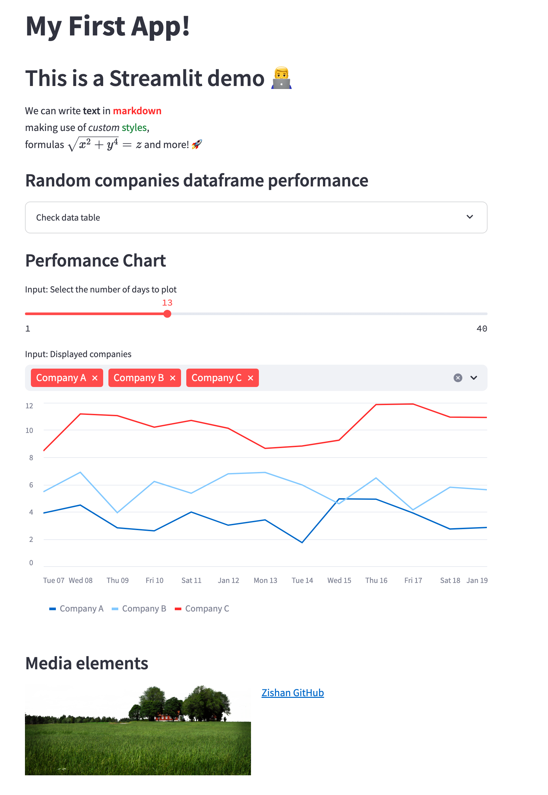

# My Streamlit App Hosted on EC2 using CDK - In few line of codes


## Welcome to your Automated EC2 Hosted Streamlit App - using CDK Python tested with Docker Locally!
This project provides an easy hosting of the streamlit app in EC2. It utilizes the Docker for testing locally and CDK for hosting the codes. If you know the CDK, within few setps one is able to host the streamlit on EC2 using this repository.

## How to Host it in AWS?
**Step1: Git clone this repository to your local machine**
```
git clone https://github.com/zishanyusuf/cdk_ec2_streamlit.git
```

**Step2: Test the streamlit locally in your Docker**
You test your app while navigating within the APP `streamlit_app` folder
```
cd streamlit_app
docker build . -t cdk_streamlit_docker_image
docker run --name cdk_streamlit_container -p 8501:8501 -d -v ${PWD}:/app cdk_streamlit_docker_image
```
Test if your streamlit app is working fine accessing your local hosted URL: http://localhost:8501/

**Step3: Launch the EC2 Instance and push the streamlit app code using CDK**
To deploy the APP with CDK, navigate back to the parent folder `cdk_ec2_streamlit`
```
#Navigate to the parent folder cdk_ec2_streamlit
cd ..

#Snythesize and push the CDK
cdk synth
cdk deploy
```

That's all. You are all set!! The CDK terminal will spit out the URL where you can access your streamlit app hosted on EC2!.

## Acknowledgement
App taken from [GitHub streamlit_yt by @enricd](https://github.com/enricd/streamlit_yt/tree/main/streamlit_intro)


# Welcome to your CDK Python project!

This is a blank project for CDK development with Python.

The `cdk.json` file tells the CDK Toolkit how to execute your app.

This project is set up like a standard Python project.  The initialization
process also creates a virtualenv within this project, stored under the `.venv`
directory.  To create the virtualenv it assumes that there is a `python3`
(or `python` for Windows) executable in your path with access to the `venv`
package. If for any reason the automatic creation of the virtualenv fails,
you can create the virtualenv manually.

To manually create a virtualenv on MacOS and Linux:

```
$ python3 -m venv .venv
```

After the init process completes and the virtualenv is created, you can use the following
step to activate your virtualenv.

```
$ source .venv/bin/activate
```

If you are a Windows platform, you would activate the virtualenv like this:

```
% .venv\Scripts\activate.bat
```

Once the virtualenv is activated, you can install the required dependencies.

```
$ pip install -r requirements.txt
```

At this point you can now synthesize the CloudFormation template for this code.

```
$ cdk synth
```

To add additional dependencies, for example other CDK libraries, just add
them to your `setup.py` file and rerun the `pip install -r requirements.txt`
command.

## Useful commands

 * `cdk ls`          list all stacks in the app
 * `cdk synth`       emits the synthesized CloudFormation template
 * `cdk deploy`      deploy this stack to your default AWS account/region
 * `cdk diff`        compare deployed stack with current state
 * `cdk docs`        open CDK documentation

Enjoy!
